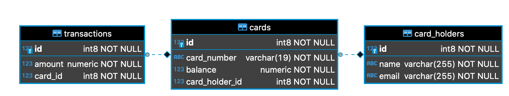

# Card Management API

We are about to build a REST API for a card management platform.
This API should allow us to do basic crud operations for cardholders and cards.
We should be able to insert money or create transactions on a given card.
Some features are already built, but in general we need the following additions in any order.

1. Optional filtering to the get cards endpoint, so we can retrieve only active cards and/or cards with a balance >= X
2. An endpoint to create a transaction which withdraws money from the credit card
    1. Email the cardholder if the cards balance drops below X
3. An endpoint to set cards as inactive (soft delete cards)
4. An endpoint to delete a cardholder and all it’s cards and transactions
5. Add a scheduler job to email cardholders whose card has expired today


## Current database structure




## Requirements

- Java 8
- Docker/Docker Compose
- Postgres (Provided through `docker-compose.yml`)
- Mailhog (Provided through `docker-compose.yml`)

## Getting started
To start this API a Postgres database is required.
We can start the additional services through Docker Compose with below command:

```shell
docker-compose up
```

Starting the services through Docker Compose will setup the following:
- Mailhog
  - UI: http://localhost:9000
  - Smtp: `9001`
- Postgres: `9002`

To start up the application with Gradle:

```shell
./gradlew bootRun
```

### IntelliJ
There is supplied run configurations to the two above commands within the `.run` directory
